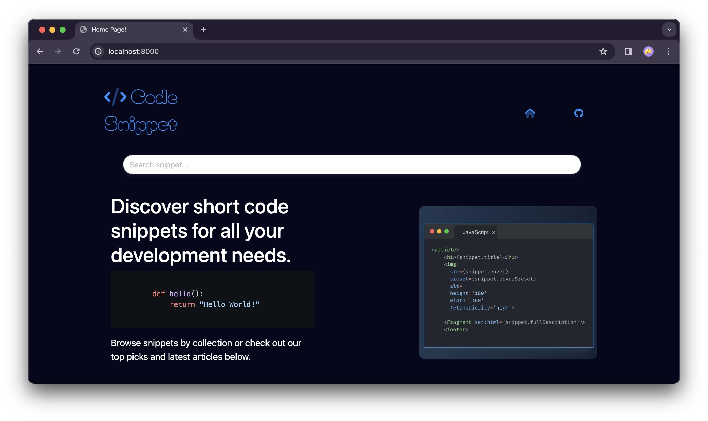
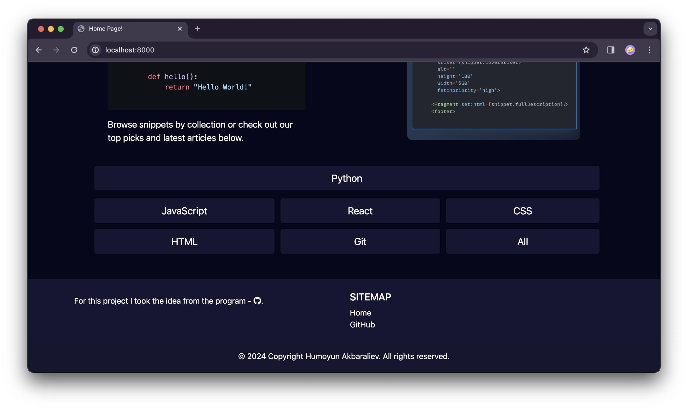
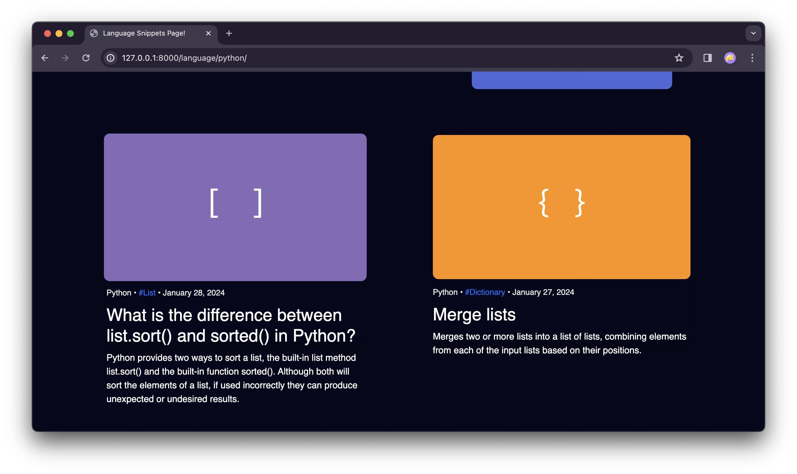
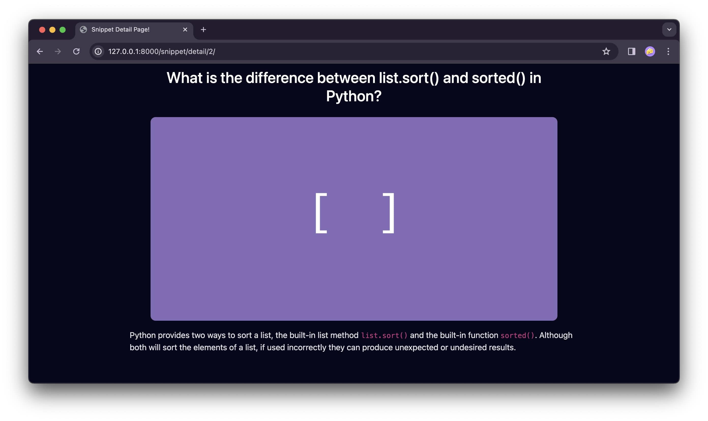
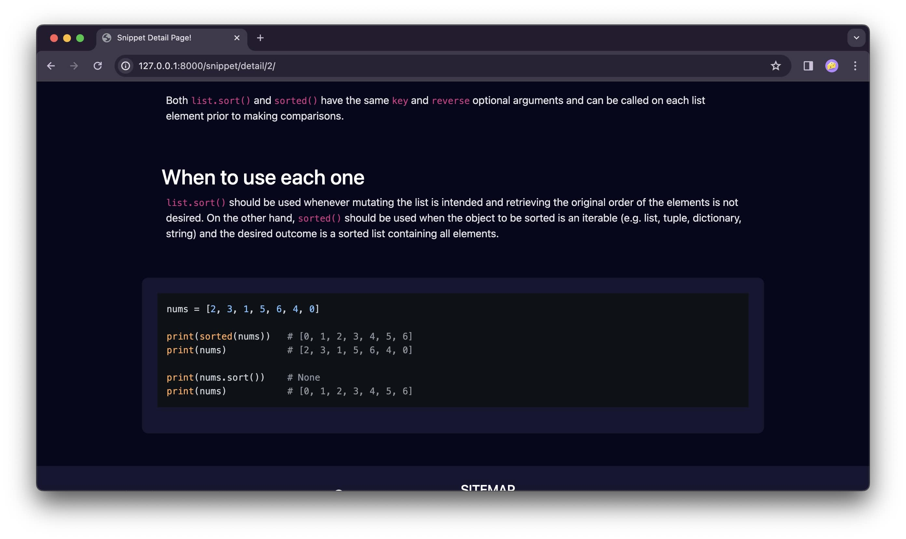
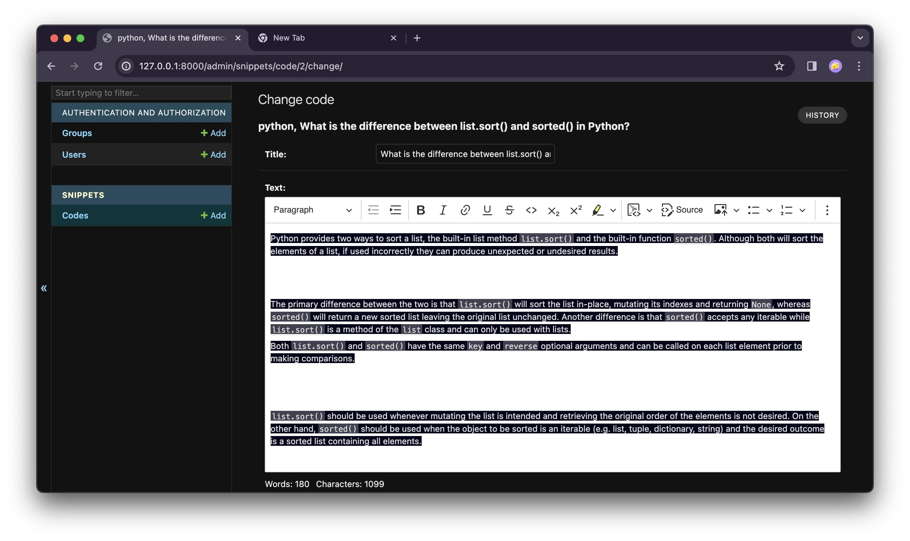

# Code Snippet

> Bu dastur nima uchun yaratildi?, Qanday muammoni yecha o'ladi o'zi?, Manfa't bormi bu dasturni kimdur ishlatishidan, ... shunga oxshagan savolar berishingiz mumkun, va men bu savolaringizga to'laqonlik bilan `XA` deb javo bera olaman va buni xozir sizga isbotlab beraman, unda Kedik!

> Barcha `dasturchilarda` muammolar bo'ladi albatta, ammo lekin ko'pincha bir xil yoki mashxur muammolar bo'ladi demoqchiman xar bir dasturchida uchraydigan va boshqalar, siz ularni yechish uchun har hil `Saytlar`, `Ishtimoiy tarmoqlar`, `YouTube`, `Stackoverflow` ... dan  javob izlab ko'rgansiz, ba'zida soat lab o'tirib izlab xech topa olmagan bo'liszhingiz mumkun xatto, yokida ko'pincha xolatlar bo'ladi topgan kodingiz juda eski bo'ladi uni ishlata olmaysiz va hokazo shunga oxshab qadrli vaqtlaringizni sarflab ko'p vaqtingizni yo'qotib qo'ygansiz. Bugun men, bu masalaga o'zim qoldan kelguncha yechim berishga xarakat qildim.

> Bu `dastur` o'z ichiga bir nechta `Dasturlash` tillarni olib ularga doir kod parchalarni, interview savollarga javoblarni sizga taqdim qila di eng afzal taraflari bu dastur xuddi Stackoverflow ga oxshab kodlarni rangli qilib va amaliy panel ni sizga taqdim qiladi siz u orqali kodlaringizni o'zingizni ta'bingizga qarab, dizaynlish ingiz mumkun va pasda rasm da korsatib ketganman
Dasturga hozircha kodlar admin tomonidan qoshiladi va dasturlash tillari ham hozircha kamroq.

> `Xulosa`, bu dastur ga yana kodlarni o'zgartirish va barcha kod yozish xususiyatlarini qoshsak menimcha barchaga manfatl bo'ladi deb oylaymiz, hozircha vaqt yetmay qoldi, Raxmat.







**Пример программы так работает.**


## Запуск приложения

6. Запустите приложение с помощью команды:
    ```bash
    $ python manage.py runserver
    ```

## Выход из среды

7. Для выхода из виртуального окружения выполните:
    ```bash
    $ exit
    ```


# Docker

Для запуска данного проекта с использованием Docker, выполните следующие шаги:

## Шаги для запуска проекта

### 1. Установка Docker

Убедитесь, что на вашем компьютере установлен Docker:

- Если у вас нет Docker, скачайте его с [официального сайта](https://docs.docker.com/get-docker/) и следуйте инструкциям по установке для вашей операционной системы.

# Запуск проекта с использованием Docker

Если вы планируете запустить проект через Docker, следуйте этим шагам:

## Создание и запуск Docker-контейнера

1. Создайте образ Docker, выполните команду:
    ```bash
    $ docker build -t snippet:1.0 .
    ```

2. Запустите контейнер после успешного создания образа:
    ```bash
    $ docker run -p 8000:8000 snippet:1.0
    ```

3. Если у вас нет образа в локальном хранилище, вы можете скачать его с Docker Hub:
    ```bash
    $ docker pull python:3.11-alpine
    ```

Теперь ваш проект будет доступен в браузере по адресу `https://localhost:8000/`.

## Запуск проекта без использования Docker

Если вы хотите запустить проект без Docker:

1. Активируйте виртуальное окружение:
    ```bash
    $ pipenv shell
    ```

2. Запустите сервер приложения:
    ```bash
    $ python manage.py runserver
    ```


## Вклад 🤝
**Если вы хотите внести свой вклад в развитие приложения  пожалуйста, следуйте этим шагам:**

1. Форкните репозиторий на `GitHub`.
2. Клонируйте ваш форк репозитория на локальную машину.
3. Создайте новую ветку для вашей функции или исправления ошибки.
4. Внесите изменения и сделайте коммиты с описательными сообщениями.
5. Отправьте ваши изменения в ваш форк репозитория.
6. Создайте pull request (запрос на включение) в основной репозиторий.

## Контакты
**Если у вас есть вопросы или предложения относительно приложения, пожалуйста, свяжитесь с нами по адресу `humoyunakbaraliev1@gmail.com` Мы ценим ваше мнение!**


